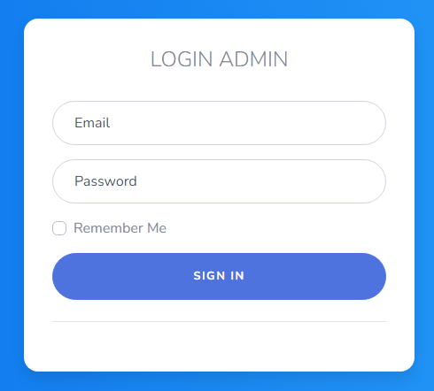

<!-- PROJECT LOGO -->
 

  <a href="https://github.com/ulumfr/PortalBerita">
<<<<<<< HEAD
    
=======
    
>>>>>>> 1457144de5578cb322654eddd735215d283aa170
  </a>

  <h3 align="center">Ninews</h3>

  

    Project Caslab Portal Berita
     
    <a href="https://github.com/ulumfr/PortalBerita">View Project</a>
  

<!-- ABOUT THE PROJECT -->
## About The Project

Ninews adalah sebuah Project Website Portal Berita dari Caslab Informatika UMM Tahun 2022 yang dibuat untuk memberikan segala informasi yang berkaitan tentang dunia Pendidikan, Kesehatan, dan Teknologi yang terbaru pada perkembangan sekarang. 

Kata Ninews ini diambil dari beberapa kata yaitu Nine (Sembilan) dan News (Berita). Jadi, Ninews ini merupakan Project Berita yang dibuat oleh Kelompok 9 Caslab Informatika. 

Dan juga Ninews ini dapat membantu para pelajar memahami dalam pembuatan sebuah project portal berita serta penguasaan dalam bahasa pemrograman, library dan framework.

Fitur :
* Terdapat beberapa kategori berita 
* Terdapat pilihan berita (Popular, Editor, Trending)
* Dashboard Admin (Manajemen Berita)
* Login dan Logout

<!-- USAGE EXAMPLES -->
## Access

Penggunakan dashboard admin untuk memanajemen berita bisa login pada username dan password yang sudah dicantumkan dibawah ini. 

* Username : admin@gmail.com
* Password : password

<!-- Member -->
## Member

1. Aisyaharani Nuriyanto (Ketua) [BackEnd]
2. Bahrul Ulum Fadhlur Rohman [FrontEnd]
3. Feisyah Az-Zahra [Support]

<!-- LICENSE -->
## License

Distributed under the MIT License. See `LICENSE.txt` for more information.

